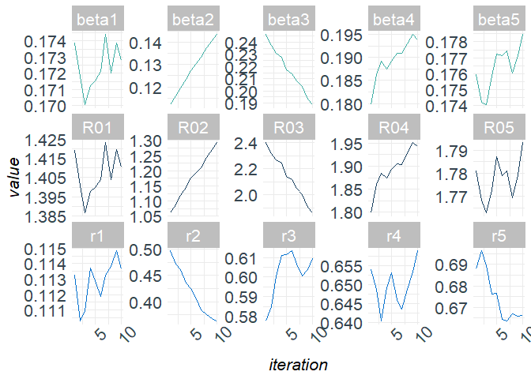
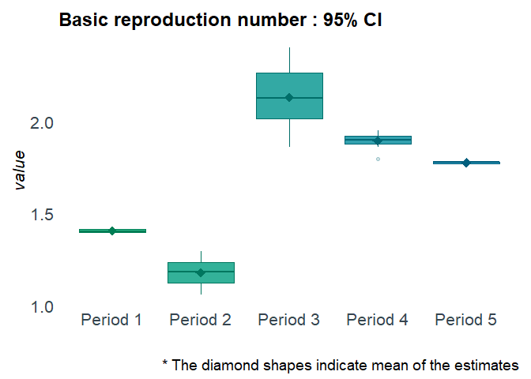
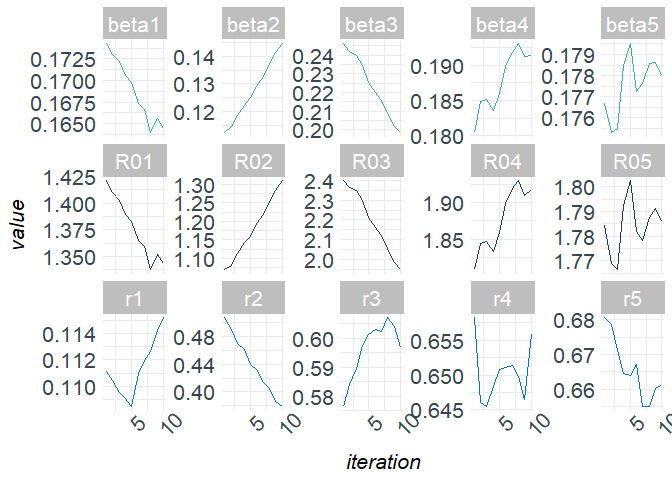
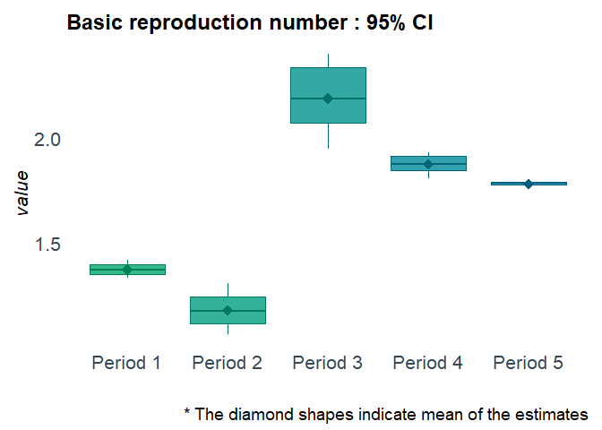
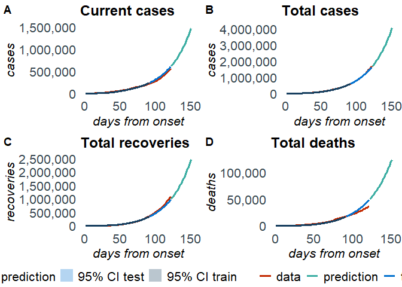
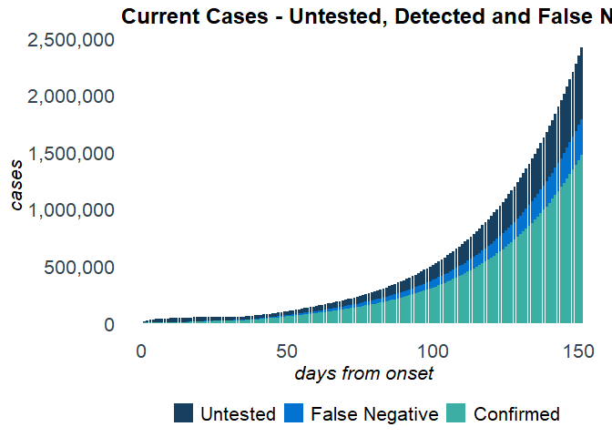

<!-- README.md is generated from README.Rmd. Please edit that file -->

# R package `SEIRfansy`

# Extended Susceptible-Exposed-Infected-Recovery Model

[](https://github.com/umich-biostatistics/SIERfansy)
[](https://github.com/umich-biostatistics/SEIRfansy)
[](https://doi.org/https://doi.org/10.1101/2020.09.24.20200238)

## Overview

This `R` package fits Extended Susceptible-Exposed-Infected-Recovery
(SEIR) Models for handling high false negative rate and symptom based
administration of diagnostic tests.

## Installation

If the devtools package is not yet installed, install it first:

``` r
install.packages('devtools')
```

``` r
# install SEIRfansy from Github:
devtools::install_github('umich-biostatistics/SEIRfansy') 
```

Once installed, load the package:

``` r
library(SEIRfansy)
#> Registered S3 methods overwritten by 'car':
#>   method                          from
#>   influence.merMod                lme4
#>   cooks.distance.influence.merMod lme4
#>   dfbeta.influence.merMod         lme4
#>   dfbetas.influence.merMod        lme4
```

## Example Usage

For this example, we use the built-in package data set `covid19`, which
contains dailies and totals of cases, recoveries, and deaths from the
COVID-19 outbreak in India from January 30 to September 21 of 2020.

### Setup

You will need the `dplyr` package for this example.

``` r
library(dplyr)
#> 
#> Attaching package: 'dplyr'
#> The following objects are masked from 'package:stats':
#> 
#>     filter, lag
#> The following objects are masked from 'package:base':
#> 
#>     intersect, setdiff, setequal, union
```

Training data set:

For training data, we use cases from April 1 to June 30

``` r
train = covid19[which(covid19$Date == "01 April "):which(covid19$Date == "30 June "),]
```

Testing data set:

For testing data, we use cases from July 1 to July 31

``` r
test = covid19[which(covid19$Date == "01 July "):which(covid19$Date == "31 July "),]
```

Data format for multinomial and Poisson distribution:

``` r
train_multinom = 
  train %>% 
  rename(Confirmed = Daily.Confirmed, 
         Recovered = Daily.Recovered,
         Deceased = Daily.Deceased) %>%
  dplyr::select(Confirmed, Recovered, Deceased)

test_multinom = 
  test %>% 
  rename(Confirmed = Daily.Confirmed, 
         Recovered = Daily.Recovered,
         Deceased = Daily.Deceased) %>%
  dplyr::select(Confirmed, Recovered, Deceased)

train_pois = 
  train %>% 
  rename(Confirmed = Daily.Confirmed) %>%
  dplyr::select(Confirmed)
```

Initialize parameters:

``` r
N = 1341e6 # population size of India
data_initial = c(2059, 169, 58, 424, 9, 11)
pars_start = c(c(1,0.8,0.6,0.4,0.2), c(0.2,0.2,0.2,0.25,0.2))
phases = c(1,15,34,48,62)
```

## SEIRfansy()

If interest is in model estimation but not prediction, then use
`SEIRfansy()`. Otherwise, use `SEIRfansy.predict()` (see below).

``` r
?SEIRfansy
```

``` r
cov19est = SEIRfansy(data = train_multinom, init_pars = pars_start, 
                     data_init = data_initial, niter = 1e3, BurnIn = 1e2, 
                     model = "Multinomial", N = N, lambda = 1/(69.416 * 365), 
                     mu = 1/(69.416 * 365), period_start = phases, opt_num = 1, 
                     auto.initialize = TRUE, f = 0.15)
#> Finding MLE
#> 1 MLE run finished!
#>  
#> MLE estimates : 
#> beta = ( 0.18, 0.1, 0.25, 0.18, 0.18 )
#> r = ( 0.112, 0.531, 0.544, 0.65, 0.688 )
#>  
#> MCMC:
#> Iter 100  A = 0  :  0.1757 0.109 0.2516 0.1787 0.1765 0.1102 0.5162 0.568 
#> 0.6611 0.6807
#> Iter 200  A = 1.3916  :  0.1739 0.112 0.2464 0.1797 0.176 0.1132 0.4969 0.5774 
#> 0.654 0.688
#> Iter 300  A = 0  :  0.1718 0.1159 0.2374 0.1862 0.1742 0.1103 0.4715 0.5849 
#> 0.6488 0.6964
#> Iter 400  A = 0  :  0.1701 0.1196 0.2309 0.1891 0.1741 0.111 0.4617 0.6004 
#> 0.6404 0.6894
#> Iter 500  A = 0  :  0.1712 0.1235 0.2274 0.1875 0.1758 0.1137 0.4353 0.6111 
#> 0.6492 0.676
#> Iter 600  A = 0  :  0.1715 0.1274 0.2173 0.1893 0.1772 0.1129 0.4252 0.6113 
#> 0.6532 0.6765
#> Iter 700  A = 8e-04  :  0.1721 0.1304 0.2143 0.1909 0.1771 0.1119 0.4048 0.6134 
#> 0.646 0.6644
#> Iter 800  A = 0.0098  :  0.1744 0.1331 0.2084 0.1909 0.1774 0.1133 0.3846 
#> 0.6066 0.6436 0.6634
#> Iter 900  A = 0  :  0.172 0.1374 0.204 0.193 0.176 0.1138 0.3754 0.6007 0.6488 
#> 0.6668
#> Iter 1000  A = 266446.9  :  0.1739 0.1407 0.1934 0.195 0.1771 0.1148 0.3682 
#> 0.604 0.6534 0.6658
#> Iter 1100  A = 0  :  0.1728 0.1435 0.1887 0.1938 0.1785 0.1136 0.3626 0.6096 
#> 0.6589 0.6661
```

Inspect the results:

``` r
names(cov19est)
class(cov19est$mcmc_pars)
names(cov19est$plots)
```

Plot the results:

``` r
plot(cov19est, type = "trace")
```

<!-- -->

``` r
plot(cov19est, type = "boxplot")
```

<!-- -->

## SEIRfansy.predict()

If interest is in model estimation and prediction, then use
`SEIRfansy.predict()`, which first runs `SEIRfansy()` internally, and
then predicts.

``` r
?SEIRfansy.predict
```

``` r
cov19pred = SEIRfansy.predict(data = train_multinom, init_pars = pars_start, 
                              data_init = data_initial, T_predict = 60, niter = 1e3, 
                              BurnIn = 1e2, data_test = test_multinom, model = "Multinomial", 
                              N = N, lambda = 1/(69.416 * 365), mu = 1/(69.416 * 365), 
                              period_start = phases, opt_num = 1, 
                              auto.initialize = TRUE, f = 0.15)
#> Estimating ... 
#>   
#> Finding MLE
#> 1 MLE run finished!
#>  
#> MLE estimates : 
#> beta = ( 0.18, 0.1, 0.25, 0.18, 0.18 )
#> r = ( 0.112, 0.531, 0.544, 0.65, 0.688 )
#>  
#> MCMC:
#> Iter 100  A = 8e-04  :  0.174 0.1081 0.2534 0.1786 0.1768 0.1122 0.5231 0.562 
#> 0.6583 0.6925
#> Iter 200  A = 0  :  0.1743 0.1124 0.2464 0.1804 0.1767 0.1111 0.5071 0.5763 
#> 0.6582 0.6806
#> Iter 300  A = 0  :  0.173 0.1145 0.2421 0.1848 0.1753 0.1105 0.4896 0.584 
#> 0.6461 0.6786
#> Iter 400  A = 139.3671  :  0.1722 0.1185 0.24 0.1851 0.1755 0.1096 0.4703 
#> 0.5896 0.6454 0.6711
#> Iter 500  A = 0  :  0.1706 0.1221 0.2343 0.1836 0.1785 0.1091 0.4618 0.5976 
#> 0.6484 0.6644
#> Iter 600  A = 0.1641  :  0.1698 0.125 0.2253 0.186 0.1795 0.1084 0.4392 0.6012 
#> 0.6508 0.6639
#> Iter 700  A = 0.0676  :  0.1674 0.1292 0.2198 0.1899 0.1773 0.111 0.4324 0.603 
#> 0.6511 0.6672
#> Iter 800  A = 0.0015  :  0.1666 0.1325 0.2158 0.1919 0.1776 0.112 0.4134 0.6024 
#> 0.6514 0.655
#> Iter 900  A = 0  :  0.164 0.137 0.2086 0.1931 0.1786 0.1126 0.4053 0.607 0.6498 
#> 0.6548
#> Iter 1000  A = 45485.74  :  0.1656 0.1412 0.2018 0.1913 0.1786 0.1142 0.3865 
#> 0.6041 0.6466 0.66
#> Iter 1100  A = 0  :  0.1645 0.1446 0.1985 0.1914 0.178 0.1152 0.3783 0.5968 
#> 0.6558 0.6611
#>  
#> Predicting ...
```

Inspect the results:

``` r
names(cov19pred)
class(cov19pred$prediction)
class(cov19pred$mcmc_pars)
names(cov19pred$plots)
```

Plot the results:

``` r
plot(cov19pred, type = "trace")
```

<!-- -->

``` r
plot(cov19pred, type = "boxplot")
```

<!-- -->

``` r
plot(cov19pred, type = "panel")
```

<!-- -->

``` r
plot(cov19pred, type = "cases")
```

<!-- -->

### Current Suggested Citation

Ritwik Bhaduri, Ritoban Kundu, Soumik Purkayastha, Mike Kleinsasser,
Lauren J Beesley, Bhramar Mukherjee. “EXTENDING THE
SUSCEPTIBLE-EXPOSED-INFECTED-REMOVED(SEIR) MODEL TO HANDLE THE HIGH
FALSE NEGATIVE RATE AND SYMPTOM-BASED ADMINISTRATION OF COVID-19
DIAGNOSTIC TESTS: SEIR-fansy.” medRxiv 2020.09.24.20200238; doi:
<https://doi.org/10.1101/2020.09.24.20200238>
